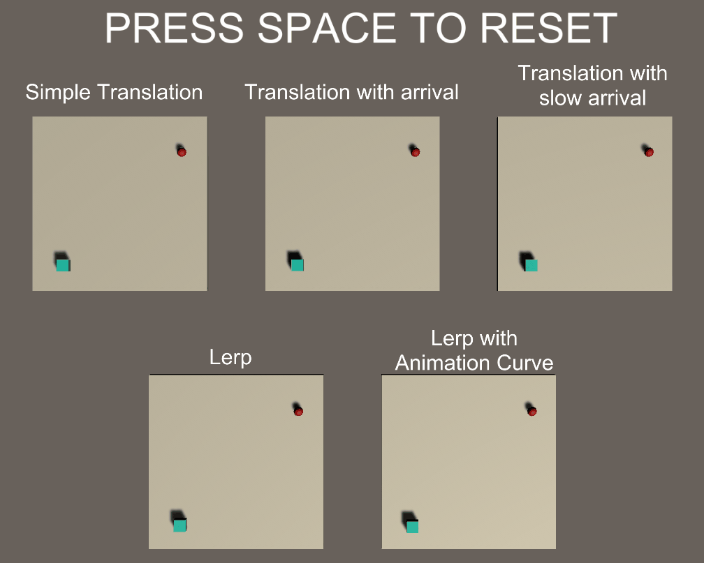

# Translation Concepts with Unity 3D

This demonstration was prepared with Unity 2019.4.4f1.

## Setup instructions
- Clone repository to your local disk
- Download Unity 2019.4.4f1 with Unity Hub if not already installed
- Locate the project with Unity Hub
- Open the project and wait for the Editor to open
- Enter Play Mode (by clicking play)
- Press the spacebar key to reset the demo
- Enjoy!

